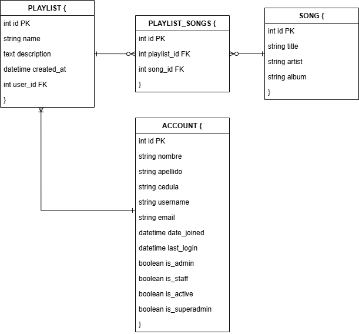

# 🎵 API de Música - Django + DRF

Este es un proyecto de backend para una aplicación de música desarrollado con **Python 3.11.9**, **Django** y **Django REST Framework**, utilizando una base de datos **PostgreSQL**.

### ¿Por qué se eligió Django y DRF?

Se eligieron **Django** y **Django REST Framework** porque permiten construir rápidamente APIs robustas, seguras y escalables, aprovechando un ecosistema maduro de bibliotecas, autenticación integrada y administración avanzada. Además, **Django** simplifica mucho la gestión de usuarios, permisos y la creación de endpoints RESTful con **DRF**.

---

## 🚀 Requisitos

- Python 3.11.9  
- PostgreSQL 13

---

## ⚙️ Instalación del proyecto

### 1. Clonar el repositorio

```bash
git clone https://github.com/julido123/music-app-backend
cd music-app-backend
```

### 2. Crear base de datos en PostgreSQL

Antes de correr el proyecto, asegúrate de tener PostgreSQL instalado y crea una base de datos vacía. Por defecto se espera que sea:

- **Nombre**: `music_db`
- **Usuario**: `postgres`
- **Contraseña**: `12345`
- **Host**: `localhost`
- **Puerto**: `5432`

Si tus datos son distintos, actualízalos en el archivo `settings.py` en la línea **89**, que contiene la siguiente configuración:

```python
DATABASES = {
    'default': {
        'ENGINE': 'django.db.backends.postgresql',
        'NAME': 'music_db',
        'USER': 'postgres',
        'PASSWORD': '12345',
        'HOST': 'localhost',
        'PORT': '5432',
    }
}
```

---

## 🧰 Opción 1: Usar el script automático `setup.bat` (solo en Windows)

Si estás en Windows, puedes ejecutar el script `setup.bat` desde una consola PowerShell con el siguiente comando:

```powershell
.\setup.bat
```

Este script realizará los siguientes pasos por ti:

1. Crea un entorno virtual (`venv`)
2. Activa el entorno virtual
3. Instala las dependencias de `requirements.txt`
4. Ejecuta las migraciones necesarias
5. Crea un usuario administrador por defecto:
   - **Usuario**: `admin`
   - **Contraseña**: `admin123`
6. Crea canciones de ejemplo para probar la app
7. Inicia automáticamente el servidor local

✅ Luego de esto, puedes empezar a usar la app desde el frontend, desde el panel de administración (`/admin`) o desde la documentación Swagger.

🔁 En futuras ocasiones, solo debes activar el entorno virtual y correr el servidor con:

```bash
venv\Scripts\activate
python manage.py runserver
```

---

## 🛠️ Opción 2: Instalación paso a paso manual

Si prefieres hacerlo manualmente o estás en un sistema que no sea Windows, sigue estos pasos:

### 1. Crear entorno virtual

```bash
python -m venv venv
```

### 2. Activar entorno virtual

- En **Windows**:

  ```bash
  venv\Scripts\activate
  ```

- En **Mac/Linux**:

  ```bash
  source venv/bin/activate
  ```

### 3. Instalar dependencias

```bash
pip install -r requirements.txt
```

### 4. Aplicar migraciones

```bash
python manage.py makemigrations
python manage.py migrate
```

### 5. Crear superusuario

```bash
python manage.py createsuperuser
```

### 6. Crear canciones de ejemplo (opcional)

```bash
python scripts/crear_canciones.py
```

### 7. Correr el servidor

```bash
python manage.py runserver
```

---

## 📚 Documentación de la API

Documentación Swagger (interactiva):

👉 [http://localhost:8000/api/docs/](http://localhost:8000/api/docs/)

Documentación Redoc (más detallada):

👉 [http://localhost:8000/api/redoc/](http://localhost:8000/api/redoc/)

---

## 👤 Acceso al panel de administración

Accede a:  
👉 [http://localhost:8000/admin/](http://localhost:8000/admin/)

Puedes usar el usuario creado por el `setup.bat` (`admin` / `admin123`) o el que hayas creado manualmente.

---

## 🧪 Tests

Para ejecutar los tests unitarios:

```bash
python manage.py test
```

---

## 🧩 Estructura principal
- `music_api/` → Módulo principal que contiene los archivos `setting.py` y `urls.py`.
- `music/` → App principal que contiene los modelos `Playlist` y `Song`.
- `account/` → App para autenticación y gestión de usuarios.
- `scripts/crear_superusuario.py` → Script para crear un superusuario por defecto.
- `scripts/crear_canciones.py` → Script para crear canciones de prueba.
- `setup.bat` → Automatiza la configuración del entorno en Windows.
- `drf-spectacular` → Generador de documentación OpenAPI (Swagger/Redoc).

---

## ✅ Notas adicionales

- Siempre activa tu entorno virtual antes de ejecutar comandos de Django.
- Puedes modificar los scripts en `scripts/` si deseas crear datos personalizados para pruebas.
- El backend está preparado para integrarse con un frontend en Angular o cualquier otro framework.

---

## 🗂️ Estructura de la base de datos

La aplicación utiliza una base de datos relacional PostgreSQL con el siguiente esquema:



### Tablas principales:


* *ACCOUNT*: Contiene la información de los usuarios (cuenta).

  Campos principales:


  * id (PK): ID único.

  * nombre, apellido, cedula, username, email.

  * date_joined, last_login: Fechas de registro y último acceso.

  * is_admin, is_staff, is_active, is_superadmin: Roles y estado del usuario.


* *PLAYLIST*: Representa listas de reproducción creadas por los usuarios.

  Campos principales:


  * id (PK): ID único de la playlist.

  * name, description: Nombre y descripción.

  * created_at: Fecha de creación.

  * user_id (FK): Relación con el usuario que la creó (ACCOUNT).


* *SONG*: Canciones disponibles en la aplicación.

  Campos principales:


  * id (PK): ID único de la canción.

  * title, artista, álbum: Información de la canción.


* *PLAYLIST\_SONGS*: Tabla intermedia para la relación muchos a muchos entre PLAYLIST y SONG.

  Campos principales:


  * id (PK): ID único de la relación.

  * playlist_id (FK): Referencia a la playlist (PLAYLIST).

  * song_id (FK): Referencia a la canción (SONG).


Las relaciones entre las tablas permiten que un usuario cree múltiples playlists y que una playlist contenga múltiples canciones.

---

## 🛠 Tablas de Django por defecto

Además de las tablas propias de la app (como music_playlist, music_song, etc.), *Django* genera automáticamente varias tablas relacionadas con la gestión de usuarios, permisos y sesiones:

### 🔑 *auth\_group*

* *Propósito*: Define grupos de usuarios para aplicar permisos en bloque.
* *Campos principales*:

  * id (PK): ID del grupo.
  * name: Nombre del grupo.

### 🔐 *auth\_group\_permissions*

* *Propósito*: Relaciona los grupos (auth_group) con los permisos (auth_permission).
* *Campos principales*:

  * id (PK): ID único.
  * group_id (FK): ID del grupo.
  * permission_id (FK): ID del permiso.

### 🔑 *auth\_permission*

* *Propósito*: Define los permisos (crear, ver, cambiar, borrar) asociados a los modelos.
* *Campos principales*:

  * id (PK): ID del permiso.
  * name: Nombre
  * content_type_id: El modelo al que aplica.
  * codename: Código interno (ej.: add_user, change_song).

### 📝 *django\_admin\_log*

* *Propósito*: Registra todas las acciones realizadas en el panel de administración (/admin).
* *Campos principales*:

  * id (PK): ID único.
  * action_time: Fecha/hora de la acción.
  * user_id: Usuario que la hizo.
  * content_type_id, object_id, object_repr: Datos del objeto modificado.
  * action_flag, change_message: Qué tipo de acción fue (agregado, cambio, borrado) y el mensaje de cambio.

### 📦 *django\_content\_type*

* *Propósito*: Representa todos los modelos instalados en el proyecto.
* *Campos principales*:

  * id (PK): ID único.
  * app_label: App a la que pertenece (ej.: auth, music).
  * model: Nombre del modelo.

### 🔄 *django\_migrations*

* *Propósito*: Guarda el historial de migraciones aplicadas.
* *Campos principales*:

  * id (PK): ID único.
  * app, name: App y nombre de la migración.
  * applied: Fecha de aplicación.

### 🔑 *django\_session*

* *Propósito*: Gestiona las sesiones de los usuarios conectados (si usas sesiones en lugar de solo tokens).
* *Campos principales*:

  * session_key (PK): Clave única de la sesión.
  * session_data: Información serializada.
  * expire_date: Fecha de expiración.

---


